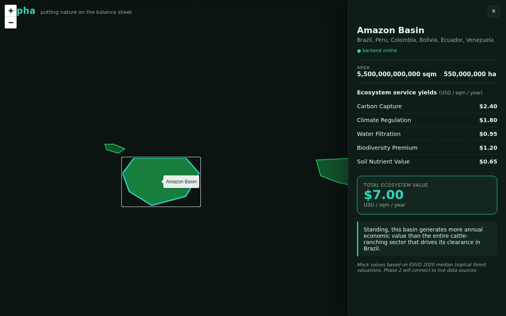

# alpha

> _Putting nature on the balance sheet._

`alpha` is a full-stack geospatial web platform and API that calculates and
visualizes the true financial value of natural ecosystems. A standing rainforest
is one of the most valuable financial assets on earth — `alpha` makes its
ecosystem services (carbon capture, cooling, water filtration, biodiversity, soil
nutrients) visible and quantifiable as a **Total Ecosystem Value (TEV)** per sqm
per year.

See [`ARCHITECTURE.md`](./ARCHITECTURE.md) for the full methodology and phased
roadmap.

## Preview

Clicking a rainforest region confirms backend connectivity and opens a side panel
with its full Total Ecosystem Value breakdown:



---

## Stack

| Service | Tech | Port |
| --- | --- | --- |
| `frontend` | Vue 3 + Vite, Leaflet.js | 3000 |
| `backend` | FastAPI, SQLAlchemy + GeoAlchemy2 | 8000 |
| `db` | PostgreSQL 15 + PostGIS | 5432 |

## Quickstart

```bash
docker compose up --build
```

Then open:

- **Web app:** http://localhost:3000 — full-screen world map with the 4 major
  rainforest regions. Click a region for its mock TEV breakdown.
- **API health:** http://localhost:8000/health
- **API docs (Swagger):** http://localhost:8000/docs

### Try the valuation endpoint

```bash
curl -X POST http://localhost:8000/api/v1/valuation \
  -H 'Content-Type: application/json' \
  -d '{"type":"Polygon","coordinates":[[[-60,-3],[-60,-2],[-59,-2],[-59,-3],[-60,-3]]]}'
```

## Repository layout

```
alpha/
├── ARCHITECTURE.md        # methodology + phased roadmap
├── docker-compose.yml     # db + backend + frontend
├── backend/               # FastAPI valuation API
└── frontend/              # Vue 3 + Vite + Leaflet world map
```

## License

[AGPL-3.0](./LICENSE).
